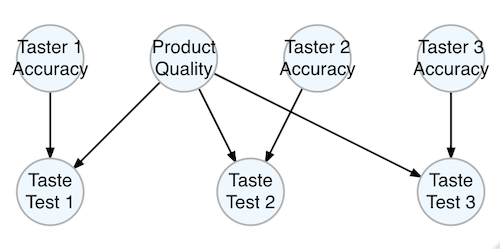

# Taste Test Model

The included example model `tasting_model` is a [Bayesian network](https://en.wikipedia.org/wiki/Bayesian_network) -- a [directed acyclic graph (DAG)](https://en.wikipedia.org/wiki/Directed_acyclic_graph) -- created with the [bnlearn](http://www.bnlearn.com/) package.

The goal of the model is to infer whether the product being tasted is actually good or not. There are three taste testers -- who can be accurate or inaccurate -- each one passing judgement on the product: good or bad. The product is given 50/50 chances of being good or bad, just as the tasters are given 50/50 chances of being accurate or not.

## Conditional Probability Table

The probability of a product being judged good or bad depends on its actual quality and whether the taster is accurate in their judgement. The conditional probabilities are as follows:

| Product Quality | Taste Tester | Pr(Test = Good) |
|:----------------|:-------------|----------------:|
| Good            | Accurate     |             0.9 |
| Good            | Inaccurate   |             0.6 |
| Bad             | Accurate     |             0.1 |
| Bad             | Inaccurate   |             0.4 |

## Diagram and Inference

There are three such taste test nodes and three respective taste tester accuracy nodes:

Once we observe the results of the three taste tests, we can infer:

- the probability of each taster's accuracy
- the probability that the product being tasted is actually good

Furthermore, if we know any one tester's tasting ability and judgement, we can set that node and it becomes more evidence which propagates to update the probabilities of the remaining, unobserved nodes.
